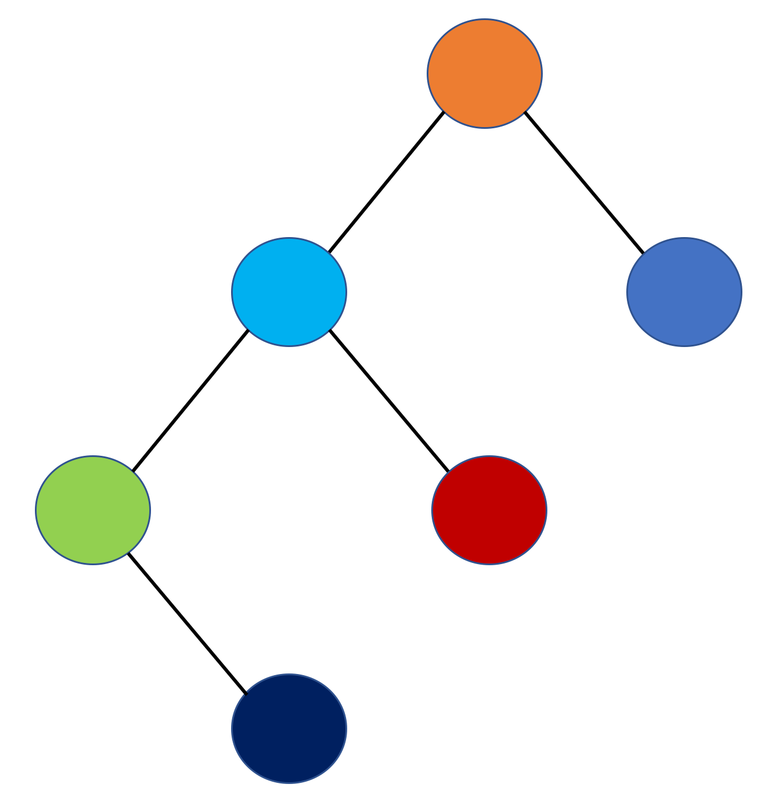

# 動態規劃

動態規劃\(Dynamic programming\)與Divide-and-Conquer都會先將問題切成數個較小且性質相同的問題，但DP會先去計算小的問題，並儲存結果，以快取cache的概念，使得有些東西不用一直重複地被計算，而可以直接取得，屬於由下而上\(Bottom-up\)的思考概念。

## Algorithm1 費伯納西數列\(Divide-and-Conquer\)

* 問題：求得費伯納西數列的第n個值
* 輸入：非負整數n
* 輸出：費柏納西數列的第n個值

```text
def fibnoacci_recursive(n):
    if(n<0):
        raise ValueError
    elif(n<=1):
        return 1
    else:
        return fibnoacci_recursive(n-1)+fibnoacci_recursive(n-2)
```

## Algorithm2 費伯納西數列\(動態規劃\)

* 問題：求得費伯納西數列的第n個值
* 輸入：非負整數n
* 輸出：費柏納西數列的第n個值

```text
def fibnoacci_iterative(n):
    if(n<0):
        raise ValueError
    x,y = 0,1
    for i in range(n):
        x,y = y,x+y
    return y
```

可以看到上面兩個不同的費伯納西數列演算法，都可以達到我們要的目的，但所花費的成本卻大大不同。首先是遞迴版的，很明顯這就是屬於Divide-and-Conquer的演算法，因為每個數字都是前兩個數字的總和，因此我們可以以遞迴的方式達到，並由上而下慢慢遞減，直到達到閥值可以直接return，再慢慢往上進行總和最終求得目標值。但這種方式卻有個缺點，那就是有很多數字會重複被計算，這樣就會造成時間的浪費。Algorithm1 的時間複雜度應為O\(2^n\)，其所花費的成本是相當大的。

那麼再來讓我們看看迴圈版吧，可以看到其是由最小的數字開始慢慢累加，可以看到這樣就可以避免數字被重複計算，此演算法的時間複雜度為O\(n\)，大大節省了時間成本。

## Algorithm3 二次項係數\(Divide-and-Conquer\)

* 問題：計算二次項係數
* 輸入：非負整數n與k，其中k&lt;=n
* 輸出：二次項係數值

```text
def bin_divide_and_conquer(n,k):
    if(n==0 or k==n):
        return 1
    else:
        return bin(n-1,k-1)+bin(n-1,k)
```

因公式轉換可求得上述的演算法邏輯，但一樣，會有個問題，那就是會重複計算數值，此演算法的時間複雜度為2\*bin\(n,k\) - 1。

## Algorithm4 二次項係數\(DP\)

* 問題：計算二次項係數
* 輸入：非負整數n與k，其中k&lt;=n
* 輸出：二次項係數值

```text
def bin_dp(n,k):
    mapping_table = [[0 for _ in range(k+1)] for _ in range(n+1)]
    for i in range(n+1):
        for j in range(k+1):
            if(j==0 or i==j):
                mapping_table[i][j] = 1
            else:
                mapping_table[i][j] = mapping_table[i-1][j-1] + mapping_table[i-1][j]
    return mapping_table[n][k]
```

時間複雜度為：O\(nk\)。

## Algorithm5 佛洛伊德最短路徑

* 問題：計算各頂點間的最短路徑
* 輸入：有向權重圖，以相鄰矩陣表示
* 輸出：最短路徑圖

```text
def floyd(w):
    for i in range(len(w)):
        for j in range(len(w)):
            for k in range(len(w)):
                w[j][k] = min(w[j][k],w[j][i]+w[i][k])
    return w
```

時間複雜度為：O\(n^3\)。

## Algorithm6 佛洛伊德最短路徑2

* 問題：計算各頂點間的最短路徑
* 輸入：有向權重圖，以相鄰矩陣表示
* 輸出：最短路徑圖與各頂點最短路徑中中介點之矩陣圖

```text
def floyd(w):
    p = [[-1 for _ in range(len(w))] for _ in range(len(w))]
    for i in range(len(w)):
        for j in range(len(w)):
            for k in range(len(w)):
                if(w[j][k] > w[j][i]+w[i][k]):
                    p[j][k] = i
                    w[j][k] = w[j][i]+w[i][k]
    return w,p
```

時間複雜度為：O\(n^3\)。

### 印出最短路徑

```text
def shortest_floyd_path(P,q,r):
    if(P[q][r]!=-1):
        shortest_floyd_path(P,q,P[q][r])
        print('v'+str(P[q][r]))
        shortest_floyd_path(P,P[q][r],r)
```

時間複雜度為：O\(n\)

> 最佳化原則：
>
> 1. 建立一個遞迴性質解出該問題的某最佳解
> 2. 以bottom-up求出最佳解
> 3. 用bottom-up建構出最佳解
>
> 若最佳化原則要可應用在某問題上，他必須符合以下條件：當某問題存在最佳解，則所有子問題必存在最佳解。

## Algorithm7 連續矩陣相乘

假設我們有A,B,C,D,E,F要相乘，而維度分別為：  
A = 5 \* 2  
B = 2 \* 3  
C = 3 \* 4  
D = 4 \* 6  
E = 6 \* 7  
F = 7 \* 8  
那麼若我們使用結合律的概念將一些矩陣先進行乘法，所花費的乘法次數會不會下降呢？

先來看看普通兩個矩陣相乘時，他所花費的乘法次數會多少，假設是A\*B，那麼他的乘法次數應該為 5 \* 2 \* 3，而若A \* \(B \* C\)則他所花費的乘法應為 2 \* 3 \* 4 + 5 \* 2 \* 4 = 64，但若為\(A\*B\) \* C，則所花費的乘法應為 5 \* 2 \* 3 + 5 \* 3 \* 4 = 90，透過此小例子就知道我們在這邊所要解決的就是找出最佳的矩陣相乘順序。

而在這個問題中，就是不斷地去測試哪些乘法順序的乘法次數較少，那麼很肯定的，一定有很多東西會被重複計算，這時動態規劃又派上用場了。

我們會嘗試建立兩個矩陣，一個為記錄所花費的最少乘法次數，一個是記錄乘法的順序。其中記錄花費的最少乘法次數的矩陣應該長得像下面這個圖：

<table>
  <thead>
    <tr>
      <th style="text-align:left"></th>
      <th style="text-align:left">A</th>
      <th style="text-align:left">B</th>
      <th style="text-align:left">C</th>
      <th style="text-align:left">D</th>
      <th style="text-align:left">E</th>
      <th style="text-align:left">F</th>
    </tr>
  </thead>
  <tbody>
    <tr>
      <td style="text-align:left">A</td>
      <td style="text-align:left">0</td>
      <td style="text-align:left">(A*B)</td>
      <td style="text-align:left">(A*B)*C
        <br />A*(B*C)</td>
      <td style="text-align:left">
        <p>((A*B)*C)*D</p>
        <p>(A*(B*C))*D</p>
        <p>A*((B*C)*D)</p>
        <p>A*(B*(C*D))</p>
      </td>
      <td style="text-align:left">
        <p>(((A*B)*C)*D)*E</p>
        <p>((A*(B*C))*D)*E</p>
        <p>(A*((B*C)*D))*E</p>
        <p>(A*(B*(C*D)))*E</p>
        <p>A*(((B*C)*D)*E)</p>
        <p>A*((B* (C*D))*E)</p>
        <p>A*(B*((C*D)*E))</p>
        <p>A*(B*(C*(D*E)))</p>
      </td>
      <td style="text-align:left">~</td>
    </tr>
    <tr>
      <td style="text-align:left">B</td>
      <td style="text-align:left">0</td>
      <td style="text-align:left">0</td>
      <td style="text-align:left">(B*C)</td>
      <td style="text-align:left">
        <p>(B*C)*D</p>
        <p>B* (C*D)</p>
      </td>
      <td style="text-align:left">
        <p>((B*C)*D)*E</p>
        <p>(B* (C*D))*E</p>
        <p>B*((C*D)*E)</p>
        <p>B*(C*(D*E))</p>
      </td>
      <td style="text-align:left">~</td>
    </tr>
    <tr>
      <td style="text-align:left">C</td>
      <td style="text-align:left">0</td>
      <td style="text-align:left">0</td>
      <td style="text-align:left">0</td>
      <td style="text-align:left">(C*D)</td>
      <td style="text-align:left">
        <p>(C*D)*E</p>
        <p>C*(D*E)</p>
      </td>
      <td style="text-align:left">~</td>
    </tr>
    <tr>
      <td style="text-align:left">D</td>
      <td style="text-align:left">0</td>
      <td style="text-align:left">0</td>
      <td style="text-align:left">0</td>
      <td style="text-align:left">0</td>
      <td style="text-align:left">(D*E)</td>
      <td style="text-align:left">~</td>
    </tr>
    <tr>
      <td style="text-align:left">E</td>
      <td style="text-align:left">0</td>
      <td style="text-align:left">0</td>
      <td style="text-align:left">0</td>
      <td style="text-align:left">0</td>
      <td style="text-align:left">0</td>
      <td style="text-align:left">(E*F)</td>
    </tr>
    <tr>
      <td style="text-align:left">F</td>
      <td style="text-align:left">0</td>
      <td style="text-align:left">0</td>
      <td style="text-align:left">0</td>
      <td style="text-align:left">0</td>
      <td style="text-align:left">0</td>
      <td style="text-align:left">0</td>
    </tr>
  </tbody>
</table>可以發現row與column對應的矩陣是相鄰時，他會紀錄其直接相乘的，而其餘所記錄的皆是：  
列數+1的欄位中的乘積組合結合自己的欄的矩陣的新組成 以及  
欄數-1的欄位中的成績組合結合自己的列的矩陣的新組成  
例如：\[1\]\[3\]的位置，會是由\[1\]\[2\]與自己欄值的矩陣結合 和 \[2\]\[3\]與自己的列值的矩陣結合。

> \[1\]\[2\]為\(B\*C\)，則\[1\]\[3\]就要加上\(B\*C\)\*D的組合，而\[2\]\[3\]為\(C\*D\)，則\[1\]\[3\]就要再加上B\*\(C\*D\)。

基於上述的概念，我們可以發現我們會重複計算很多東西，但事實上，我們僅需要在各欄位中先找出他們最小乘法次數的組合並記錄起來，就可以節省很多不必要的重複計算功夫。

* 問題：找出最佳連續矩陣乘法順序
* 輸入：記錄各矩陣的維度的串列，每個矩陣以tuple方式記錄
* 輸出：回傳記錄最少乘法次數的矩陣M、記錄最佳乘法順序P

```text
def multiMulti(U):
    n = len(U)
    M = [[0 for _ in range(n)] for _ in range(n)]
    P = [[0 for _ in range(n)] for _ in range(n)]
    for j in range(1,n):
        for i in range(j-1,-1,-1):
            if(j==i+1):
                #連續矩陣
                
                #記錄相鄰矩陣乘法次數
                M[i][j] = U[i][0] * U[j][0] * U[j][1]
                
                #記錄乘法順序
                P[i][j] = [i,j]
                
            else:
                val1 = M[i][j-1] + U[i][0] * U[j-1][1] * U[j][1]
                #欄數-1的位置值
                
                val2 = M[i+1][j] + U[i][0] * U[i+1][0] * U[j][1]
                #列數-1的位置
                
                #記錄擁有較少乘法次數的組合
                if(val1>val2):
                    M[i][j] = val2
                    #記錄乘法次數
                    
                    P[i][j] = P[i+1][j] + [i]
                    #記錄選擇出的子乘積順序以及自己
                else:
                    M[i][j] = val1
                    #記錄乘法次數
                    
                    P[i][j] = P[i][j-1] + [j]
                    #記錄選擇出的子乘積順序以及自己
                    
    return M,P
```

則最後輸出時，M\[0\]\[-1\]和P\[0\]\[-1\]就會記錄最低乘法次數與最佳乘法順序。

時間複雜度：O\(n^2\)

## Algorithm8 平衡二叉樹

有讀過資料結構的一定都會學到二叉樹，二叉樹在查找資料上面最好的情況下是可以達到O\(logN\)的效果，但這當然是這個二叉樹是非常平衡的時候，當其不平衡時，那麼就會變成線性的查找速度。那麼要如何避免這點呢？那就是當二叉樹內的資料被改變時，我們就去檢查他是否是平衡的，我們設有左子節點+1而右子節點為-1，如此當底下的節點相加時若總和為0、1或-1則代表為平衡的。

所以我們的問題結構應該為：

* 問題：建構平衡二叉樹，並保持中序排序
* 輸入：欲加入數值或欲刪除數值
* 輸出：平衡二叉樹

首先先讓我們來建立樹節點，這是二叉樹的基本單元，每個單元的屬性有儲存的值data，左節點left，右節點right，parent父節點以及用來計算平衡分數的factor，還有一些檢查方法：

### 建立樹節點

```text
class TreeNode:
    def __init__(self,data,left = None,right = None,parent = None,factor = 0):
        self.data = data
        self.left = left
        self.right = right
        self.parent = parent
        self.factor = factor
    
    def hasLeftChild(self):
        return self.left!=None
    
    def hasRightChild(self):
        return self.right!=None
    
    def isLeftChild(self):
        return (self.parent and self.parent.left == self)
    
    def isRightChild(self):
        return (self.parent and self.parent.right == self)
    
    def isLeaf(self):
        return not (self.left or self.right)
```

### 建立二叉樹

接著讓我們來建立一個含有增加值方法的二叉樹，相信大家都還記得，二叉搜索樹的規範就是當加入的數值比根節點大就往右子節點走，而比較小就往左子節點走，而我們就依照此規範進行編寫。

```text
class AVL_Tree:
    def __init__(self):
        self.root = None
    
    def put(self,data):
        if(self.root):
            self._put(data,self.root)
        else:
            self.root = TreeNode(data)
    
    def _put(self,data,run_node):
        if(run_node.data > data):
            #要加入的數值比較小，要往左子樹走
            if(run_node.hasLeftChild()):
                run_node = run_node.left
                self._put(data,run_node)
            else:
                #因為無左子節點，所以可以指定其左子節點為要加入的樹節點
                newNode = TreeNode(data)
                run_node.left = newNode
                newNode.parent = run_node
                #因新增一節點，所以要進行更新factor的動作
                self.update_factor(run_node.left)
        else:
            #要加入的數值比較大，要往右子樹走
            if(run_node.hasRightChild()):
                run_node = run_node.right
                self._put(data,run_node)
            else:
                #因為無右子節點，所以可以指定其右子節點為要加入的樹節點
                newNode = TreeNode(data)
                run_node.right = newNode
                newNode.parent = run_node
                #因新增一節點，所以要進行更新factor的動作
                self.update_factor(run_node.right)
```

可以發現上面的程式碼中，再新增一個節點後，會呼叫一個物件方法update\_factor，其目的就是要進行平衡數值的更新。

那麼接下來就來編寫計算平衡數值的物件方法

### 平衡數值計算

```text
Class AVL_Tree:
    ...
    
    def update_factor(self,check_node):
            if check_node.factor > 1 or check_node.factor < -1:
                #因已喪失平衡了，所以必須進行處理
                self.rebalance(check_node)
                return
            else:
                if(check_node.isLeftChild()):
                    #是從左子節點傳上來，所以平衡數值+1
                    check_node.parent.factor+=1
                elif(check_node.isRightChild()):
                    #是從右子節點傳上來，所以平衡數值+1
                    check_node.parent.factor-=1
                
                if(check_node.factor!=0):
                    #因是動態地不斷地更新平衡，因此若此節點的平衡點數已為0，便代表目前是已平衡的狀態，而不用再繼續往上檢查。
                    self.update_factor(check_node.parent)
```

由上面的代碼可以看到幾個重點，那就是當節點的平衡數值是大於1或小於-1時，代表已喪失平衡了，所以必須進行處理，這是就要再call另外一個物件方法rebalance來進行平衡的動作。

另外一個重點就是，因為此二叉樹是不斷地動態更新維持平衡，因此我們只要看所傳入的節點是左邊還是右邊，就可以來進行平衡數值的更新，而當更新完後，其數值為0，代表其上的節點平衡數值不會被影響到了。要注意一點就是，雖然平衡數值為1或-1時也是平衡，但他還是會影響到其父節點的平衡數值，因此要進行更新平衡數值的動作。

### 調整節點維持平衡

在編寫rebalance的方法前，我們必須要先來了解該如何進行移動，才能確保維持二叉搜索樹的性質又可以調整至平衡。

而其實移動的方式在AVL\_Tree中有四種，分別是左轉、右轉、先右轉再左轉、先左轉再右轉，而依類型在分為RR\(連續兩個右子節點\)、LL\(連續兩個左子節點\)、RL\(右子節點接著左子節點\)、LR\(左子節點接右子節點\)，接著讓我來分享怎麼轉還有什麼時機點要使用哪個轉。

#### RR類型

首先是以下這個不平衡的二叉樹，藍色節點的平衡點數應為-2，橘色的平衡點數則為-1，在這種狀況下應該進行轉換以平衡。


#### 左轉

遇到上面那種狀況時，就可以以橘色的節點為基準進行左轉。


但有時我們會遇到一個情況那就是基準節點已有左節點，那這時該怎麼辦呢？那就是將被左轉的右節點設為基準節點的左節點，因為被左轉的右節點即為後來的基準點，肯定沒東西。 以下圖為例，橘色節點的平衡點數為2，需要重新平衡。


這時我們一樣以藍色節點為基準點進行左轉，這時藍色節點的左子節點應為橘色節點，這時該怎麼辦呢？答案就是將紅色節點接到橘色節點的右子節點，因爲紅色節點的值必大於橘色節點，作為橘色節點的右子節點是沒問題的。另外，因原橘色節點的右子節點為藍色節點，所以一定不會發生節點衝突的現象。


#### LL類型

接著讓我們來看看下面這種狀況，綠色節點的平衡數值為2，橘色節點的平衡數值為1，不平衡，所以一樣需要進行調整的動作。


這時僅需以橘色為基準，進行右轉的動作，如下。


除了上述這種狀況，當然也會有一種情況是基準點是有右子節點的，進而產生衝突，如下：


這時，只要將淺藍色節點的左子節點來作為橘色節點的左子節點，且因為橘色節點的左節點為淺藍色節點，所以不用害怕產生衝突。

#### RL類型

再來看看下面這張圖，淺藍色的平衡數值為-2，橘色節點的平衡數值為2，所以必須要進行調整，但這時需要先以綠色節點作為基準進行右轉，轉換成RR類型，在進行左轉。在這裡若直接以綠色節點為基準點往左轉，紅色節點就會到綠色節點的右子節點，但這樣就不符合inorder的順序。


#### 先右轉再左轉

當遇到RL類型，以綠色節點作為基準點進行右轉，就可以轉換為RR類型。


當轉換為RR類型後，就可以進行左轉轉換。


#### LR類型

遇到LR類型時，一樣也不能直接左轉，而必須先右轉轉換成LL類型，再進行左轉完成調整。




好了，有了以下概念，我們可以知道最基本的動作就是左轉和右轉，因此先讓我們來編寫左轉和右轉以及rebalance物件方法。

```text
class AVL_Tree:
    ...
    def rebalance(self,node):
        if(node.factor < 0):
            #R類型
            if(node.right.factor > 0):
                #RL類型，須先右轉再左轉
                self.rotateRight(node.right)
                self.rotateLeft(node)
            else:
                #RR類型，直接左轉
                self.rotateLeft(node)
        else:
            #L類型
            if(node.left.factor < 0):
                #LR類型，須先左轉再右轉
                self.rotateLeft(node.left)
                self.rotateRight(node)
            else:
                #LL類型，直接右轉
                self.rotateRight(node)
    
    def rotateLeft(self,old_node):
        #以原節點的右子節點來作為基準點
        new_node = old_node.right
        #將基準點的左子節點指定給原節點的右子節點，如此可以確保中序且避免節點衝突
        old_node.right = new_node.left
        #將基準點的父節點設為原節點的父節點
        new_node.parent = old_node.parent
        
        if new_node.left:
            #若基準點的左子節點是有節點的，則就要更新他的parent
            new_node.left.parent = old_node
        
        if self.root==old_node:
            #若原節點為根節點，則將基準點設為根節點
            self.root = new_node
        else:
            if(old_node.isLeftChild()):
                #若原節點為其父節點的左子節點，則必須將其父節點的左子節點設為基準點
                old_node.parent.left = new_node
            else:
                old_node.parent.right = new_node
            
        
        #將基準點的左子節點設為原節點
        new_node.left = old_node
        #將原節點的父節點設為基準點
        old_node.parent = new_node
        
        
        #進行factor的更新
        old_node.factor = old_node.factor +1 - min(0,new_node.factor)
        new_node.factor = new_node.factor +1 + max(0,old_node.factor)
    
    def rotateRight(self,old_node):
        #以原節點的左子節點來作為基準點
        new_node = old_node.left
        #將基準點的右子節點指定給原節點的左子節點，如此可以確保中序且避免節點衝突
        old_node.left = new_node.right
        #將基準點的父節點設為原節點的父節點
        new_node.parent = old_node.parent
        
        if new_node.right:
            #若基準點的左子節點是有節點的，則就要更新他的parent
            new_node.right.parent = old_node
        
        if self.root==old_node:
           #若原節點為根節點，則將基準點設為根節點
            self.root = new_node
            
        if old_node.parent:
            if old_node.isLeftChild():
                old_node.parent.left = new_node
            else:
                old_node.parent.right = new_node
            
        #將基準點的右子節點設為原節點
        new_node.right = old_node
        #將原節點的父節點設為基準點
        old_node.parent = new_node
        
        #進行factor的更新
        old_node.factor = old_node.factor -1 - max(new_node.factor,0)
        new_node.factor = new_node.factor -1 + min(old_node.factor,0)
```

在上面我們可以看到當呼叫左轉或右轉後，會進行factor的更新，那麼這些factor更新的算式又是怎麼來的呢？

首先我們先思考，我們真正移動的中應該只會有原節點和基準點的高度改變了，所以必須進行平衡數值的更新，而其他的節點則是整個樹跟著移動，所以他們平衡數值不受影響。

#### 左轉factor更新


先來處理A節點：

`old(A) = h(B) - h(C)`  
`new(A) = h(B) - h(D)`

> `h()`函式代表其高度，`old()`代表未左轉前的樹，`new()`代表左轉後的樹。

而在舊樹中，B並未被改變，所以可以直接沿襲，而`h(C)`可以用  
`(1 + max(h(D),h(E)))`取得，而到新樹中，D和E的高度再左轉後並不會被改變。

我們將新樹與舊樹相減  
==&gt; `new(A) - old(A) = h(B) - h(D) - (h(B) - (1 + max(h(D),h(E))))`  
==&gt; `new(A) - old(A) = 1 + max(h(D),h(E)) - h(D)`  
==&gt; `new(A) = old(A) + 1 + max(h(D),h(E)) - h(D)`  
接著利用 `max(a，b) -c = max(a-c，b-c)` 來轉換  
==&gt; `new(A) = old(A) + 1 + max(h(D) - h(D), h(E) - h(D))`  
==&gt; `new(A) = old(A) + 1 + max(0, h(E) - h(D))`  
==&gt; `new(A) = old(A) + 1 - min(0,h(D)-h(E))`  
==&gt; `new(A) = old(A) + 1 - min(0 , old(C))`

`old(A)` 就為old\_node，而`old(C)` 則為 new\_node，如此生成以下式子：

```text
old_node.factor = old_node.factor +1 - min(0,new_node.factor)
```


接著，讓我們來處理C節點：

`old(C) = h(D) - h(E)`  
`new(C) = h(A) - h(E)`

可以發現`h(D)`與`h(E)`進行左轉時是不會被改變的，所以可以直接移植。並將兩式互減來求得平衡數值的改變  
==&gt; `new(C) - old(C) = h(A) - h(D)`  
==&gt; `new(C) - old(C) = -(1 + max(h(B),h(D))) - h(D)`  
==&gt; `new(C) - old(C) = -1 - max(h(B) - h(D),0)`  
==&gt; `new(C) - old(C) = -1 - max(h(A),0)`  
==&gt; `new(C) = old(C) - 1 - max(h(A),0)`

old\(C\)即為new\_node，而h\(A\)則為更新後的old\(A\)，因此可得以下的式子：

```text
new_node.factor = new_node.factor -1 - max(old_node.factor,0)
```

以此為概念，右轉的平衡數值更新證明便以此類推了～

### 刪除節點

當我們想要刪掉一個節點時，我們又要來做例行的工作，調整平衡數值。那麼在刪除節點的情況中，大概可以分成三種：

1. 刪除根節點
2. 刪除葉子節點
3. 刪除中介節點

接著讓我們來依依進行分析這幾種狀況該怎麼辦吧～

#### 刪除根節點

當刪除根節點時，我們會以左子樹最小值來作為替代，以符合中序排序。

情況一：左子樹最小值有右子節點，在這種情況下要進行左轉，以確保左子樹最小值節點為葉子節點，因為如果他有子節點的話，他之後拿去替代其他節點時，其子節點就會很尷尬了。


> 可以看到，因為最小值節點父節點還有右子節點，所以上面的平衡數值不會受到影響。

情況二：左子樹最小值節點為葉子節點，這時就要往上進行平衡數值的更新，因為會產生影響，而當出現平衡數值&gt;1或&lt;-1時，就跟增加節點時一樣的處理骯法。


情況三：刪除的的根節點沒有左子節點，這時很簡單，只要直接將原根節點的左子節點設為根節點即可。

情況四：只剩一個根節點，這就直接把根節點設為None即可哈哈。

#### 刪除葉子節點

刪除葉子節點也相較比較單純一點，只要直接將其刪除，並檢查若其父節點沒有其他子節點的話就要向上進行平衡數值的更新，而當出現平衡數值&gt;1或&lt;-1時，，就跟增加節點時一樣的處理方法。


#### 刪除中介節點

刪除中介節點時，若該節點為根節點的左子樹節點，則以左子樹中最小值節點來替代，而若該節點為根節點的右子樹節點，則以右子樹中最大值節點來替代，如此可以確保中序排序順序。

而若取代節點的父節點沒有其他子節點，就要進行向上更新的動作。


但若其父節點有其他子節點，就要進行左轉或右轉，取決於取代點是在左子樹或右子樹，若為左子樹則進行左轉動作，反之右子樹則進行右轉。如下：

下圖就是展示若取代節點的父節點有其他子節點，


> 注意：每次我們都會選出一個節點來取代被刪除的點\(除了被刪除的點為葉子節點\)，這時取代點的父節點都要進行平衡數值的更新，若取代點為其父節點的左子節點，則其父節點的平衡數值應-1，反之則要+1。

基於上述概念，所以我們先建構出可以return左子樹最小的值和其父節點的`findLeftMin()`，以及return右子樹最大的值和其父節點的`findRightMax()`。

```text
class AVL_Tree:
    ...
    def findLeftMin(self):
        run_node,pre_node = self.root,self.root
        while run_node.left != None and not run_node.isLeaf():
            run_node,pre_node = run_node.left,run_node
            
        #此時run_node為左子樹中最小值的節點，而pre_node為其父節點
        return run_node,pre_node
        
    
    def findRightMax(self):
        run_node,pre_node = self.root,self.root
        while run_node.right != None and not run_node.isLeaf():
            run_node,pre_node = run_node.right,run_node
            
        #此時run_node為右子樹中最大值的節點，而pre_node為其父節點
        return run_node,pre_node
```

當建構完查找左子樹最小值和右子樹最大值後，就可以來建構刪除節點的物件方法。

```text
class AVL_Tree:
    ...
    def delete(self,data):
        run_node = self.root
        
        while(run_node!=None):    
            #找到要被刪除的節點
            if(run_node.data == data):
                break
            
            #比要查找的值小，往右子樹跑
            elif(run_node.data > data):
                run_node = run_node.left
            
            #比要查找的數值大，往左子樹跑
            else:
                run_node = run_node.right
        
        #找不到要被刪除的節點
        if run_node == None: 
            return
        
        #若要刪除的節點為根節點
        if self.root == run_node:
            
            #若只剩一個根節點
            if(self.root.isLeaf()):
                self.root = None
            else:
                #找出左子樹中最小的數值來取代，以符合中序排列
                replace,replace_parent = self.findLeftMin()

                #進行取代
                run_node.data = replace.data
                
                #刪除左子樹最小值的節點
                replace_parent.left = None
                
                #因刪除所以要將左子樹最小值節點的父節點之平衡數值-1 (因為刪除的是左子節點)
                replace_parent.factor-=1 
                
                #若所找到的最小數值為根節點，就代表了根節點已經沒有左子樹了，這時就直接將根節點設為其右子節點
                if(replace==self.root):
                    self.root = self.root.right
                else:
                    #若被刪除的左子樹最小值節點的父節點為葉節點，就代表上面的平衡數值會受到影響，所以必須進行更新
                    if(replace_parent.isLeaf()):
                        self.update_delete_facotr(replace_parent)
                    
                    #若並非為葉子節點，則要進行左轉動作，以保持左子樹最左邊的節點為葉子節點
                    else:
                        self.rotateLeft(replace_parent)
        
        #若要刪除的節點為葉節點
        elif run_node.isLeaf():
            
            #若要刪除的節點為其父節點的左子節點，直接刪除，並因被刪除的是其父節點的左子節點，所以其父節點的平衡點樹應-1
            if(run_node.isLeftChild()):
                run_node.parent.left = None
                run_node.parent.factor-=1
            
            #若要刪除的節點為其父節點的右子節點，直接刪除，並因被刪除的是其父節點的右子節點，所以其父節點的平衡點樹應+1
            else:
                run_node.parent.right = None
                run_node.parent.factor+=1
            
            #若刪除後，其父節點變成葉子節點，則代表上面的平衡數值會受到影響，所以必須進行更新
            if(run_node.parent.isLeaf()):
                self.update_delete_facotr(run_node.parent)
        
        #若要刪除的節點為中介節點
        else:
            #若要刪除的節點數值在根節點的左子樹，則找出左子樹中最小值來替代
            if(self.root.data > data):
                
                #找出左子樹中最小的數值來取代，以符合中序排列
                replace,replace_parent = self.findLeftMin()
                
                #進行取代
                run_node.data = replace.data
                
                #刪除左子樹最小值的節點
                replace_parent.left = None
                
                #因刪除所以要將左子樹最小值節點的父節點之平衡數值-1 (因為刪除的是左子節點)
                replace_parent.factor-=1
                
                #若刪除後，其父節點變成葉子節點，則代表上面的平衡數值會受到影響，所以必須進行更新
                if(replace_parent.isLeaf()):
                    self.update_delete_facotr(replace_parent)
                
                #若其父節點還有右子節點，則必須進行左轉，以確保左子樹最左邊的節點為葉子節點
                else:
                    self.rotateLeft(replace_parent)
            
            #若要刪除的節點數值在根節點的右子樹，則找出右子樹中最大值來替代
            else:
                #找出右子樹中最大的數值來取代，以符合中序排列
                replace,replace_parent = self.findRightMax()
                
                #進行取代
                run_node.data = replace.data
                
                #刪除左子樹最小值的節點
                replace_parent.right = None
                
                #因刪除所以要將右子樹最小值節點的父節點之平衡數值+1 (因為刪除的是右子節點)
                replace_parent.factor+=1
                
                #若刪除後，其父節點變成葉子節點，則代表上面的平衡數值會受到影響，所以必須進行更新
                if(replace_parent.isLeaf()):
                    self.update_delete_facotr(replace_parent)
                
                #若其父節點還有左子節點，則必須進行右轉，以確保右子樹最右邊的節點為葉子節點
                else:
                    self.rotateRight(replace_parent)
```

