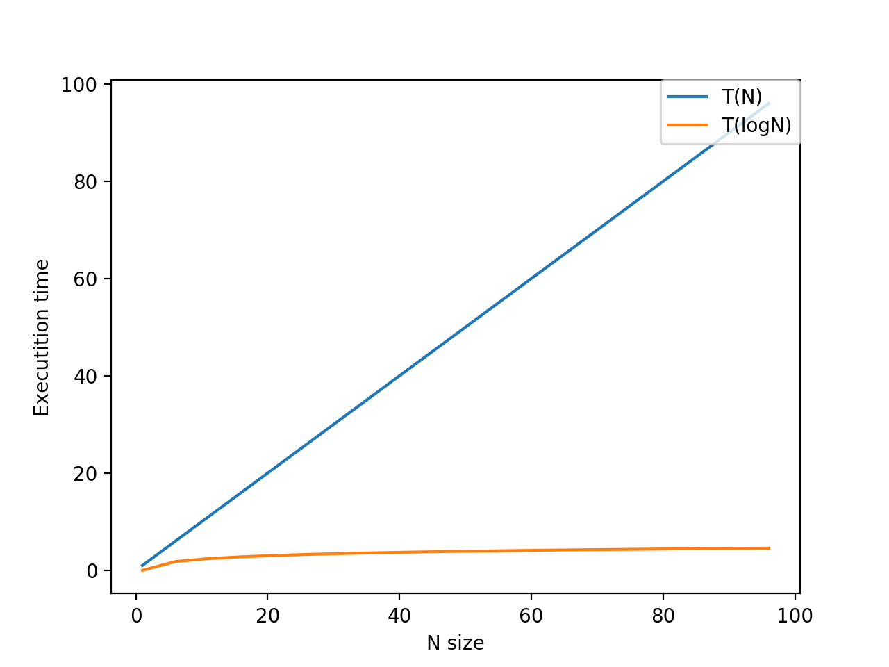

# 演算法效率分析

在現實社會中，同一種問題可能會有好多種不同的解決方式，同樣都可以解決掉問題，但有些方式成本小，有些方式成本大，有些方式好，那麼當然有些方式就相對壞了。

演算法，聽起來名字很玄，但他的主要概念其實可以直接翻譯成白話，就是解決問題的方法。程式若只執行一次，那麼成本控制或是就沒那麼重要，但事實上，程式通常會長時性地不斷運行，因此在我們編寫程式系統時，必須非常地精打細算。但，我們要如何去評斷一個演算法的好壞呢？就讓我們繼續看下去。

我們在看演算法程式最直接想到的成本，就是他使用了多少記憶體空間以及所執行的時間，也就是所謂的「空間複雜度」與「時間複雜度」。

正所謂「知己知彼，百戰百勝」，為了要分析一個演算法，那我們就必須要了解演算法的結構，也就是下面的幾項。

* 問題：遇到的問題。
* 輸入：手中擁有的資源。
* 解決問題的過程：演算法。
* 輸出：解決掉問題後的結果。

首先，先讓我們來看幾個簡單的演算法熟悉一下。

### Algorithm1 循序搜尋法

* 問題：判斷數字x是否位於陣列S中。
* 輸入：數字x、陣列S。
* 輸出：x位於陣列S的位置，若不在則回傳-1。

```text
def sequential(x,S):
    for i in range(len(S)):
        if S[i] == x:
            return i
    return -1
```

### Algorithm2 陣列加總

* 問題：加總陣列S中的數字。
* 輸入：陣列S。
* 輸出：陣列S中的數字和。

```text
from functools import reduce
def array_sum(S):
    return reduce(lambda i,j:i+j,S)
```

### Algorithm3 交換排序法

* 問題：以非遞減順序對陣列排序。
* 輸入：陣列S
* 輸出：非遞減順序的陣列S

```text
def exchangeSort(S):
    for i in range(len(S)):
        for j in range(i+1,len(S)):
            if(S[i]>S[j]):
                S[i],S[j] = S[j],S[i]
```

### Algorithm4 矩陣乘法

* 問題：求兩個矩陣A,B的乘積
* 輸入：兩個矩陣A,B
* 輸出：矩陣乘積

```text
def matrix_Mult(A,B):
    res = [[] for i in range(len(A))]
    for i in range(len(A)):
        for j in range(len(B[0])):
            k = 0
            value = 0
            while(k<len(A[0])):
                value+=(A[i][k]*B[k][j])
                k+=1
            res[i].append(value)     
    return res
            
```

### Algorithm 5 二元搜尋法

* 問題：判斷數字x是否位於陣列S中。
* 輸入：數字x、陣列S。
* 輸出：x位於陣列S的位置，若不在則回傳-1。

```text
def binarySearch(x,S):
    low,high = 0,len(S)-1
    while(low<=high):
        mid = (low+high)//2
        if(x == S[mid]):
            return mid
        elif(x < S[mid]):
            high = mid-1
        else:
            low = mid+1
    return -1
```

好了，到這邊為止，我們已經經歷了五個演算法，那麼眼尖的你一定會發現，Algorithm1和 Algorithm2的問題、輸入和輸出完全一模一樣，但所用的方式卻大大不同。

那麼在這樣所達到的效果完全一樣的情形下，究竟是哪一個演算法比較好呢？接下來就讓我們來分析比較一下吧～

## 演算法分析

剛才在最初有提到，演算法最主要的成本是空間成本與時間成本。空間成本很明顯的就是這個演算法佔用了多少記憶體空間，而時間成本就是執行此程式的時間花了多久嘛。

但問題來了，即便是同一個程式，所產生的時間與空間成本往往不會那麼一定，且人性本懶嘛，我們不可能每一次都要求算這麼仔細，因此通常我們在分析一個演算法時，通常都是採近似的方式去計算，基於這個概念，讓我們繼續看下去。

#### 時間複雜度

剛剛有提到我們不會想真的去測每次演算法所執行的時間，而是只採近似的方式去計算，但怎麼樣的方式是算近似呢？通常我們會以該演算法執行基本運算的次數。因為一般而言，隨著輸入的大小成長，整體執行時間會約略與基本運算執行的次數成正比。

> 所謂的基本運算一次指的是把機器指令執行一次。

總歸來說，演算法執行的時間會包含  
1. 基本運算所佔的時間。  
2. 額外負擔指令所佔的時間：迴圈開始前的一些起始動作，執行次數不會隨輸入大小增加而增加時間。

> p.s. 我們會將演算法的大致執行次數寫作一個複雜度函數，其可將任一正整數映射到非負實數的函數，通常以f\(n\)、g\(n\)來代表。

### 循序搜尋法 vs. 二元搜尋法

有了時間複雜度的一點點的概念後，讓我們來分析這兩種演算法。

#### 循序搜尋法分析

```text
def sequential(x,S):
    for i in range(len(S)): #T(len(S))+1
        if S[i] == x:
            return i
    return -1
```

可以看到如果是最好的情況下，應該執行一次基本運算我們就可以得到結果。  
但世事總是不盡人意，不能把最好情況當常態，因此我們要分析最壞的情況，因此應該會是陣列S的長度，也就是x根本不在S當中，或者是在最後一個位置中。

因此，循序搜尋法的時間複雜度應約為為f\(N\) = N + 1。

#### 二元搜尋法分析

```text
def binarySearch(x,S):
    low,high = 0,len(S)-1 #T(2)
    while(low<=high): #T(logN)
        mid = (low+high)//2 #T(1)
        if(x == S[mid]):
            return mid
        elif(x < S[mid]):
            high = mid-1
        else:
            low = mid+1
    return -1
```

可以看到上述，最好的情況下當然也是執行一次就找到。但我們還是必須要思考最壞的情況下會是如何，最後的結果應該會是len\(S\)的一半，因為每一次都去掉一半，直到最低界已高於最高界。

因此，二元搜尋法的時間複雜度應為f\(N\) = 2 + logN \* 2



可以看到上圖，當N的大小越來越大時，T\(N\)執行次數會遠大於T\(logN\)。因此很明顯的，二元搜尋法是優於循序搜尋法的演算法。

### 回過頭分析

接下來讓我們來分析其他還沒分析完的演算法吧。

#### 陣列加總時間複雜度分析

```text
from functools import reduce
def array_sum(S):
    return reduce(lambda i,j:i+j,S)
```

此演算法採用了reduce的技巧，但其實他本質上是一個遞迴的作用，即是把先將兩個數字傳入匿名函數，該函數作用是將兩數相加，而所得到的結果再繼續和下一個數字投入匿名函數遞迴，最後即可得到加總的效果。

因此，其時間複雜度為T\(N\)。

#### 交換排序法時間複雜度分析

```text
def exchangeSort(S):
    for i in range(len(S)): #T(N)+1
        for j in range(i+1,len(S)): #T(N-i)+1
            if(S[i]>S[j]): #T(1)
                S[i],S[j] = S[j],S[i] #T(2)
```

在最外圈的執行次數為N，而內部迴圈則會以等差為1的方式遞減。因此，總執行次數應為：\(n-1\)+\(n-2\)+\(n-3\)+...+1 = \(n\(n-1\)\)//2

因此，時間複雜度應約略為 f\(N\) = N\(N-1\)//2

#### 矩陣乘法

```text
def matrix_Mult(A,B):
    res = [[] for i in range(len(A))] #T(len(A))+1
    for i in range(len(A)): #T(len(A))+1
        for j in range(len(B[0])): #T(len(B[0]))+1
            k = 0 #T(1)
            value = 0 #T(1)
            while(k<len(A[0])): #T(len(A[0]))
                value+=(A[i][k]*B[k][j]) #T(1)
                k+=1 #T(1)
            res[i].append(value)  #T(1)   
    return res
```

最外圈執行len\(A\)的次數，而內圈則執行len\(B\[0\]\)\)的次數，最後內部則會再執行len\(A\[0\]\)的次數。 因此假設A是n\*k的矩陣，而B為k\*j的矩陣，則時間複雜度應略微T\(nkj\)。

### 最好、最差、平均情況時間複雜度

由這個小標題就可以知道，我們現在要談論這三種時間複雜度，為什麼有這三種呢？

以循序搜尋法為例，我們都知道如果說陣列的第一個數字就是我們要找的數字，那我們就只需要跑一次就完成了。但這只是理想狀況，也就是所謂的「最好情況時間複雜度」。而所謂「最壞情況時間複雜度」則是欲查找的數字不在陣列中或是在陣列的最後一個位置，導致要跑N次。最後，「平均時間複雜度」又是如何呢？  
  
我們先思考欲查找數字會在陣列中，假設陣列中每一個數字為要查找數字的機率為1/N，這很直觀，因為每一個數字應該都會是平等的。

有了這個概念，如果是第一個數字，那麼他的狀況應該會是\(1/N\)\*1，而第二個則會是\(1/N\)\*2，以此類推。最後，考量的平均時間複雜度就會是  
\(1/N\)\*1+\(1/N\)\*2+...\(1/N\)\*N = \(N\*\(N+1\)\)//\(2N\) = \(N+1\)//2

接著讓我們來考量欲查找數字不在陣列的情況下，那麼欲查找數字會是陣列第k個的數字的機率應該為p/N，而欲查找數字不在陣列的機率則為p。

基於這個概念，則平均時間複雜度應該為\(\(p/N\)\*\(N\(N+1\)\)\)//2 + N\(1- p\) = p\(N+1\)//2

若p為1，則其複雜度應為\(N+1\)//2，與假設查找數字在陣列中的一樣。但若p為1//2，則複雜度應為\(3n//4\)+\(1//4\)，代表平均會有3//4的陣列元素被搜尋到。

平均狀況時間複雜度的價值在於，我們可以知道該演算法在許多不同輸入時，總共所花的時間為何。

> 由上面可以看到，求平均狀況時間複雜度是非常麻煩的，而最好狀況時間複雜度又太不切實際，因此在實務中，我們通常會使用最壞情況時間複雜度來進行衡量分析。

### 量級Order

在打拳擊時，應該有聽過重量級、輕量級、羽量級等，不同量級不能一起PK，因為太不公平，揮拳力道與承受傷害能力都不可同等視之。而在我們分析複雜度函數時，一樣也是同等道理。

| n | 0.1n^2 | 0.1n^2 + n + 100 |
| :--- | :--- | :--- |
| 10 | 10 | 120 |
| 20 | 40 | 160 |
| 50 | 250 | 400 |
| 100 | 1000 | 1200 |
| 1000 | 100000 | 101100 |

看到上表可以看到，最終最高次項者將會主宰整個輸出的結果，因此取近似的的話，可以將除了最高次項者皆捨去。

基於這個概念，以下列幾項較為常見的複雜度量級：  
O\(1\) &lt; O\(logN\) &lt; O\(N\) &lt; O\(N LogN\) &lt; O\(N ^ 2\) &lt; O\(N ^ 3\) &lt; O\(2^n\) &lt; O\(n!\)


